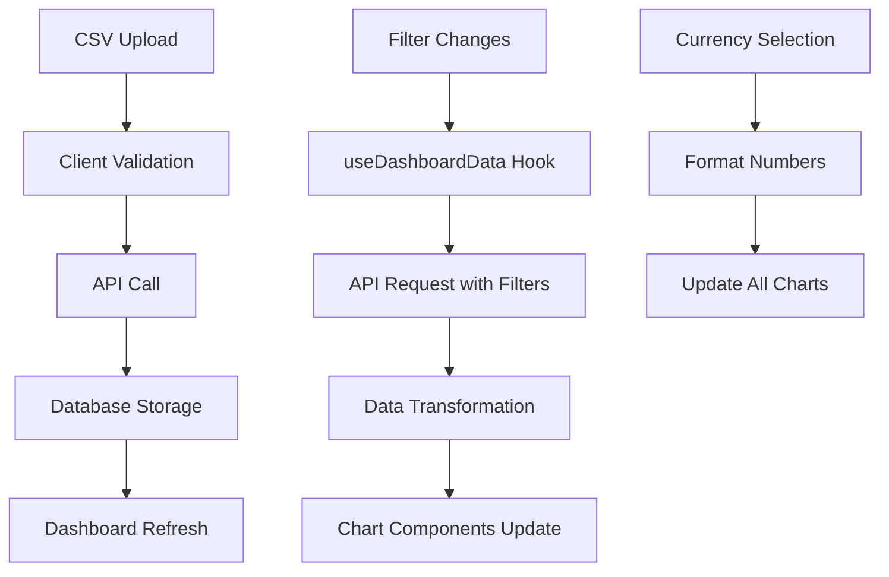

# 📊 Nimble - Invoice Dashboard (Fullstack Assignment)

A comprehensive fullstack solution for managing and analyzing invoice data with interactive visualizations, CSV import capabilities, and real-time filtering. Built with modern technologies for optimal performance and user experience.

## 🧩 Tech Stack

### Frontend

- **React 18** with TypeScript for type-safe development
- **Chakra UI** for consistent, accessible component design
- **Recharts** for interactive data visualizations
- **React Router** for client-side navigation
- **Custom Hooks** for state management and data fetching

### Backend

- **NestJS** with TypeScript
- **Prisma ORM** for database operations
- **PostgreSQL** for data persistence

### Testing

- TO DO: Jest, React Testing Library

## 🚀 Features Overview

### ✅ CSV Upload & Data Management

- **Drag & Drop CSV Upload** with real-time validation
- **Lottie Animation** feedback during upload process
- **Client-side Validation** for data integrity before API calls
- **Automatic Data Normalization** into `Invoice` and `Supplier` tables
- **Duplicate Detection** and error handling
- **Toast Notifications** for upload status feedback

### 📈 Interactive Dashboard Visualizations

- **Invoice Status Analysis**: Toggle between Pie and Bar charts
- **Overdue Trends**: Line and Area chart options with statistical badges
- **Monthly Summaries**: Bar and Line chart views with smart data limiting
- **Customer Analysis**: Horizontal bar chart with top 10 customers display
- **Real-time Currency Conversion** (USD, EUR, GBP)
- **Responsive Charts** with custom tooltips and formatters

### 🔍 Advanced Filtering System

- **Date Range Filtering**: Year and month selection with validation
- **Status Filtering**: Filter by `CONFIRMED`, `PENDING`, `CANCELLED`
- **Customer Filtering**: Dropdown with all available customers
- **Filter State Management**: Active filter indicators and quick reset
- **Collapsible Mobile Interface** for better UX on smaller screens

### 🎨 User Experience Features

- **Dark/Light Mode Support** with Chakra UI color mode
- **Responsive Design** for mobile, tablet, and desktop
- **Loading States** with elegant animations
- **Error Boundaries** for graceful error handling
- **Accessibility Features** with proper ARIA labels
- **Smart Data Visualization** with automatic data limiting for performance

## 🏗️ Frontend Architecture

### Component Structure

```
src/
├── components/
│   ├── charts/                    # Visualization components
│   │   ├── CustomerTotalsHorizontalChart.tsx
│   │   ├── InvoiceStatusBarChart.tsx
│   │   ├── InvoiceStatusPieChart.tsx
│   │   ├── MonthlySummaryBarChart.tsx
│   │   ├── MonthlySummaryLineChart.tsx
│   │   ├── OverdueTrendAreaChart.tsx
│   │   └── OverdueTrendLineChart.tsx
│   ├── filters/
│   │   └── FilterBar.tsx          # Advanced filtering interface
│   └── layout/
│       ├── DashboardLayout.tsx    # Main layout wrapper
│       ├── Navbar.tsx
│       └── Footer.tsx
├── hooks/
│   ├── useDashboardData.ts        # Data fetching and transformation
│   └── useFileUpload.ts           # CSV upload functionality
├── pages/
│   └── dashboard/
│       ├── index.tsx              # Dashboard page component
│       └── DashboardContent.tsx   # Main dashboard logic
├── routes/
│   └── AppRoutes.tsx              # Application routing
├── types/                         # TypeScript type definitions
└── constants/                     # Application constants
```

### Key Design Patterns

#### 1. **Custom Hooks Pattern**

- `useDashboardData`: Handles API calls, data transformation, and caching
- `useCsvUpload`: Manages file upload, validation, and progress tracking
- Separation of concerns between UI and business logic

#### 2. **Component Composition**

- Modular chart components with consistent interfaces
- Reusable layout components for consistent styling
- Props-based configuration for flexibility

#### 3. **State Management**

- Local state with React hooks for UI interactions
- Centralized filter state management
- Optimistic updates with loading states

#### 4. **Data Transformation Pipeline**

```typescript
API Response → useDashboardData → Memoized Processing → Chart Components
```

### Data Flow Architecture



## 🔧 Client-Side Features Deep Dive

### Chart Interactivity

- **Dynamic Chart Types**: Users can toggle between different visualization types
- **Smart Data Limiting**: Automatically limits data points for better performance
- **Custom Tooltips**: Formatted currency values and contextual information
- **Responsive Scaling**: Charts adapt to container sizes and screen resolutions

### Form Validation & UX

- **Real-time CSV Validation**: Checks data integrity before upload
- **Date Range Validation**: Ensures logical date selections
- **Progressive Enhancement**: Graceful degradation for older browsers
- **Keyboard Navigation**: Full accessibility support

### Performance Optimizations

- **React.memo**: Prevents unnecessary chart re-renders
- **useMemo/useCallback**: Optimizes expensive calculations
- **Data Chunking**: Limits displayed data for large datasets
- **Lazy Loading**: Components load on demand

## ⚙️ Business Logic Implementation

### Overdue Invoice Detection

```typescript
// Client-side logic mirrors backend rules
const isOverdue = (invoice) => {
  return invoice.dueDate < new Date() && invoice.status === "PENDING";
};
```

### Data Aggregation Strategy

- **Status Aggregation**: Groups invoices by status with totals
- **Monthly Summaries**: Time-based aggregation with count and sum
- **Customer Analysis**: Customer-wise totals with ranking
- **Trend Analysis**: Time-series data for overdue tracking

### Currency Handling

- **Multi-currency Support**: USD, EUR, GBP with proper formatting
- **Real-time Conversion**: Updates all charts when currency changes
- **Locale-aware Formatting**: Uses browser locale for number formatting

## 🧠 Design Decisions & Assumptions

### Frontend Assumptions

- **Modern Browser Support**: ES2020+ features assumed
- **JavaScript Enabled**: Progressive enhancement for core functionality
- **Responsive Design**: Mobile-first approach
- **Accessibility**: WCAG 2.1 AA compliance targeted

### Data Assumptions

- **CSV Format**: Predefined column structure expected
- **Date Format**: DD/MM/YYYY format for dates
- **Currency Codes**: ISO 4217 standard (USD, EUR, GBP)
- **Status Values**: Limited to `CONFIRMED`, `CANCELLED`, `PENDING`

### Performance Considerations

- **Chart Data Limits**: Max 24 months for line charts, top 10 for customer charts
- **Debounced Filtering**: Prevents excessive API calls
- **Memoized Calculations**: Expensive operations cached

## 🛠️ Setup Instructions

### Prerequisites

- Node.js (v18 or higher)
- npm or yarn
- Modern web browser with ES2020+ support

### Frontend Setup

```bash
# Clone the repository
git clone <repository-url>
cd nimble-invoice-dashboard

# Install dependencies
npm install

# Set up environment variables
cp .env.example .env
# Edit .env with your configuration

# Start development server
npm run dev

# Build for production
npm run build
```

### Environment Configuration

```env
# .env
PORT=4000
REACT_APP_API_BASE_URL=http://localhost:3000
```

## 📱 Responsive Design

### Breakpoints

- **Mobile**: < 768px (Single column layout)
- **Tablet**: 768px - 1024px (Adjusted grid)
- **Desktop**: > 1024px (Full grid layout)

### Mobile Optimizations

- Collapsible filter sidebar
- Touch-friendly chart interactions
- Optimized data loading
- Simplified navigation

## 🚦 Usage Guide

### Uploading Data

1. Click the "Upload CSV" button in the sidebar
2. Select a properly formatted CSV file
3. Wait for validation and upload confirmation
4. Dashboard automatically refreshes with new data

### Filtering Data

1. Use the filter sidebar to select criteria
2. Filters apply automatically to all charts
3. Active filter indicator shows when filters are applied
4. Click "Clear Filters" to reset all filters

### Viewing Insights

1. Toggle between chart types using the button groups
2. Hover over chart elements for detailed tooltips
3. Use currency selector to view data in different currencies
4. Responsive charts adapt to your screen size

## 🔮 Future Enhancements

### Planned Features

- [ ] Export functionality (PDF, Excel)
- [ ] Advanced analytics (forecasting, trends)
- [ ] Real-time data updates (WebSocket)
- [ ] User authentication and multi-tenancy
- [ ] Advanced filtering (custom date ranges, multiple selections)
- [ ] Dashboard customization (drag & drop widgets)

### Technical Improvements

- [ ] Unit and integration tests
- [ ] Performance monitoring
- [ ] Offline support (PWA)
- [ ] Advanced error boundary implementation
- [ ] Internationalization (i18n)

## 🤝 Contributing

1. Fork the repository
2. Create a feature branch (`git checkout -b feature/amazing-feature`)
3. Commit your changes (`git commit -m 'Add amazing feature'`)
4. Push to the branch (`git push origin feature/amazing-feature`)
5. Open a Pull Request

## 📄 License

This project is licensed under the MIT License - see the [LICENSE](LICENSE) file for details.

---

**Built with ❤️ for efficient invoice management and data visualization**
