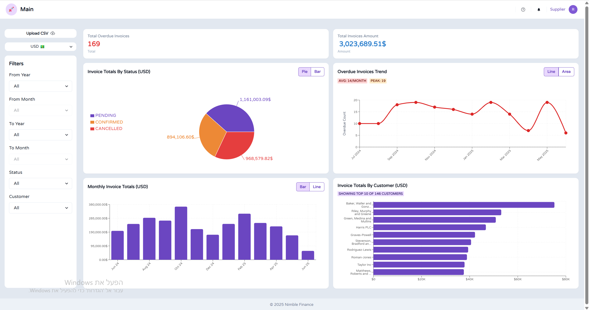

# 📊 Nimble - Invoice managment Portal

A fullstack application for managing and analyzing invoice data with interactive visualizations, CSV upload functionality, and real-time filtering capabilities.

## 🧩 Tech Stack

### Frontend

- **React** with TypeScript
- **Chakra UI** for component library and styling
- **Recharts** for data visualizations
- **React Router** for navigation

### Backend

- **NestJS** with TypeScript
- **Prisma ORM** for database operations
- **PostgreSQL** for data storage

## 🚀 Features

### Business Logic

> \_An invoice is considered **overdue** if its `invoice_due_date` has passed and its `invoice_status` is still PENDING.

- **Data Aggregation**: Aggregates invoice data efficiently by status (e.g., confirmed, cancelled, pending), billing month, and customer.
- **CSV Upload**: Supports uploading and parsing CSV files, with validation and normalization. Parsed records are stored in a relational database using Prisma, ensuring data consistency and referential integrity.
- **Filtering**: Enables advanced filtering of invoice records based on date range, invoice status, and customer identity.

## 🛠️ Setup Instructions

### Prerequisites

- Node.js (v18 or higher)
- PostgreSQL (v15 or higher)
- npm

### Backend Setup

```bash
# Navigate to backend directory
cd nimble-backend

# Install dependencies
npm install

# Set up environment variables
cp .env.example .env

# Edit .env with your database configuration
DATABASE_URL="postgresql://postgres:<your-password>@localhost:5432/nimble"

# Run database migrations
npx prisma migrate dev

# Start the backend server
npm run start:dev
```

### Frontend Setup

```bash
# Navigate to frontend directory
cd nimble-frontend

# Install dependencies
npm install

# Set up environment variables
cp .env.example .env with

# Edit .env with Port configuration
PORT=4000

# Start the development server
npm start
```

## 🏗️ Architecture & Design Choices

### Database Design

- **Normalized Schema**: Separate tables for Invoices and Suppliers to avoid data duplication
- **Scalable Structure**: Designed to handle large datasets efficiently

### Frontend Architecture

- **Component-Based**: Modular, reusable React components
- **Custom Hooks**: Separation of business logic from UI components
- **Responsive Design**: Mobile-friendly interface with Chakra UI
- **State Management**: Local state with React hooks for optimal performance

### Backend Architecture

- **Modular Structure**: Domain-organized modules (invoices, currency) for better maintainability
- **Service-Oriented**: Clear separation between controllers, services, and data processing utilities
- **RESTful Controllers**: Clean API endpoints for CSV upload, data aggregation, and filtering

### 🖼️ UI Images and Videos

#### Responsive Design Preview



#### Interactive Demos

**Responsive Dashboard Behavior**  
<video controls width="600" src="20250609-1451-42.0399211.mp4" title="Responsive Design Preview"></video>

**UI Walkthrough**  
<video controls width="600" src="20250609-1455-20.0813525.mp4" title="UI Walkthrough"></video>
